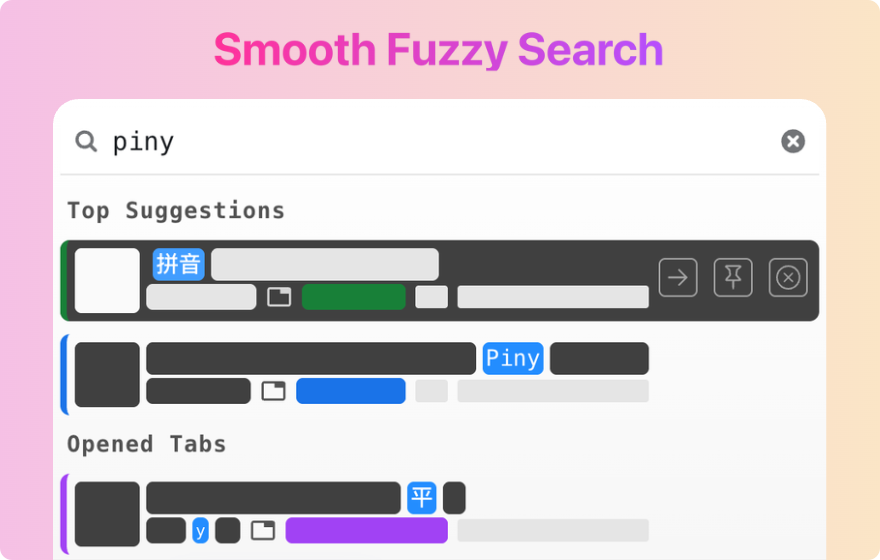
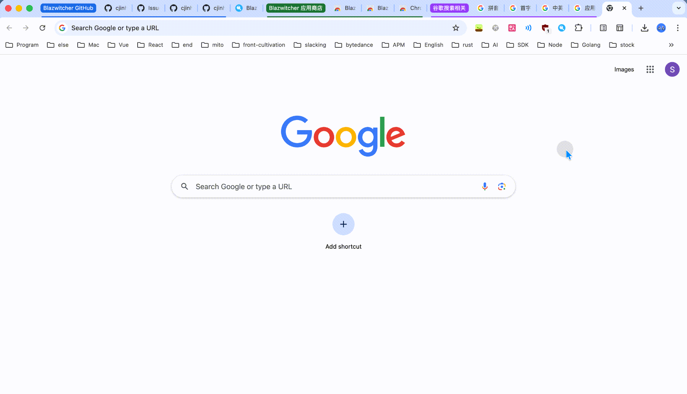
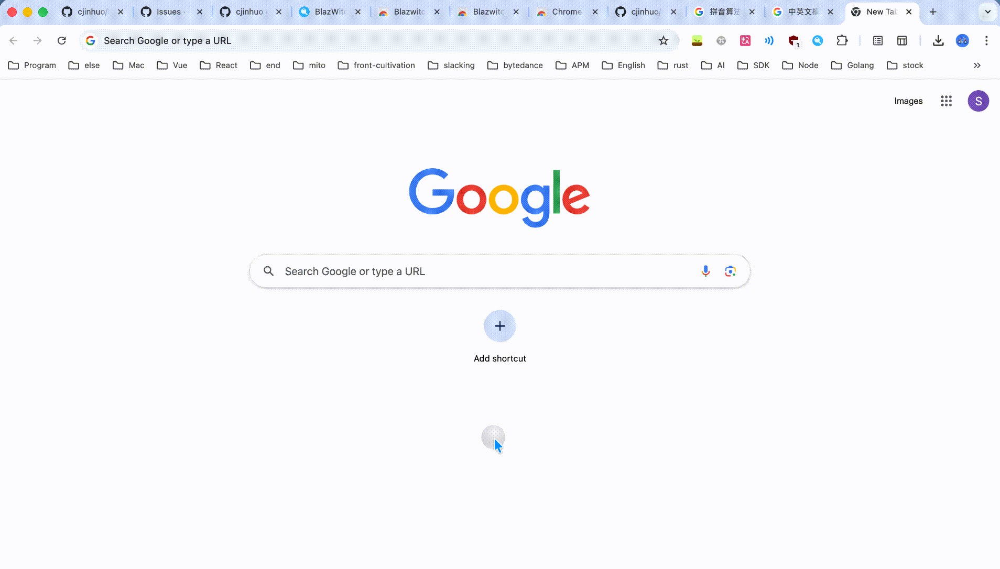

    

A Chrome Extension to blaze through your tabs, bookmarks, and history — with powerful fuzzy Pinyin search and grouping tabs by AI

# Overview
[中文 README](./docs/README_zh.md)

[Blazwitcher](https://blazwitcher.vercel.app/) is a local [Chrome Extension](https://chromewebstore.google.com/detail/blazwitcher-search-and-sw/fjgablnemienkegdnbihhemebmmonihg?hl=en-US) for searching tabs, bookmarks, and history, with support for fuzzy **Pinyin** search. It is also the perfect solution for those who work with multiple tabs open and want to switch the correct tab or create a new tab from history or bookmarks quickly without the hassle of manually operation.

# Features
## Fuzzy Pinyin Search
Supports Chinese and English mixed fuzzy search, Chinese-friendly (powered by [text-search-engine](https://github.com/cjinhuo/text-search-engine)). The search results are sorted by **weight value** (higher weight for more consecutive character matches) and last usage time in descending order, allowing you to locate your target faster. Search capabilities include:

- Initial Pinyin search

- Domain name search & Space-separated word search (no need to match in order after word segmentation)

## AI Tab Grouping
Intelligently group all tabs in the last focused window based on domain names, titles, and existing grouping situations with incremental smart grouping, greatly saving time on manually creating and updating tab groups. Of course, if you're not satisfied with the AI grouping, you can return to the initial snapshot state within 16 seconds of grouping.

## Global Second-level Search
Search data sources include:

- All opened tabs
- All bookmark records  
- By default, searches the last 1000 history items within 14 days, you can type `/s search` to modify the configuration

Also supports targeted search: type `/t` to search only opened tabs, similarly type `/b` and `/h` to search bookmarks and history respectively.

## Full Keyboard Operation
- Default activation via `Command+Shift+K` (Windows: `Ctrl+Shift+K`), you can type `/s keyboard` to customize, or directly visit [chrome://extensions/shortcuts](chrome://extensions/shortcuts) to modify it to suit your habits
- Use arrow keys (↑↓) or `Tab` key to select content, press `Enter` to switch or open the desired tab
- Trigger actions directly through commands under `/`, for example, typing `/ai` followed by enter will trigger AI tab grouping
- Use shortcuts to pin/unpin, open history, open current bookmark location, etc.
- Type `/s` to enter the settings page, where you can customize shortcuts for various functions

## Ideal For
Those people who are looking for quick action and speed, like:
- 🧑‍💻 Developers
- 💻 Multitaskers
- 🏄🏻 Surfers

# Quick Installation
1. Visit [Chrome Extension Store](https://chromewebstore.google.com/detail/blazwitcher-search-and-sw/fjgablnemienkegdnbihhemebmmonihg?hl=en-US)
2. Add it to your browser

## Shortcut
The default **shortcut key** to activate Blazwitcher Extension is `Command+Shift+K` on Mac, and `Ctrl+Shift+K` on Windows. Of course, you can type `/s keyboard` to customize it, or directly visit [chrome://extensions/shortcuts](chrome://extensions/shortcuts) to modify it to suit your habits.

# Contributing
Please see the [contributing guidelines](./CONTRIBUTING.md) to learn more.

A big thanks to all of our amazing [contributors](https://github.com/cjinhuo/blazwitcher/graphs/contributors) ❤️

Feel free to join the fun and send a PR!

# 📞 Contact
Welcome to raise issues. You can contact me via WeChat or email if you have good suggestions (note: Blazwitcher)
* wx: cjinhuo
* email: cjinhuo@qq.com