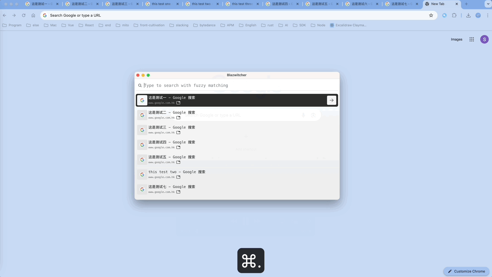

    
    
A local tool for searching tabs, bookmarks, and history

# Overview
[中文 README](./docs/README_zh.md)

Blazwitcher is a local tool for searching tabs, bookmarks, and history, with support for fuzzy **Pinyin** search. It is also the perfect solution for those who work with multiple tabs open and want to switch the correct tab or create a new tab from history or bookmarks quickly without the hassle of manually operation.

## Features
- Tab Search: Search across all Chrome tabs you opened
- History Search: Search the last 200 history item
- Bookmark Search: Search across all your bookmarks
- Intuitive Ordering: The result of searching are listed by most recently used
- Switch and create tab rapidly: Just key down 'enter' to switch or open the tab you want rapidly
- Fuzzy Pinyin Search: Convert to Chinese characters to Pinyin and support fuzzy search which be very kind for Chinese

## Ideal For
Those people who are looking for quick action and speed, like:
- 🧑‍💻 Programers
- 💻 Multitasker
- 🏄🏻 Researchers

# Quick Start
## Install Instruction
**Google Chrome**
1.  visit [Chrome Extension Store](https://chrome.google.com/webstore/detail/fjgablnemienkegdnbihhemebmmonihg)
2.  Add it to your browser

## searching
Click the icon in the extension bar then type pinyin or specific word to fuzzy search.

## shortcut
The default **shortcut key** to active Blazwitcher Extension is `Command+.(Command+Period)` on Mac, and `Ctrl+.(Ctrl+Period)` on Windows. Of course, you could visit [chrome://extensions/shortcuts](chrome://extensions/shortcuts) to modify it to suit your habits.
