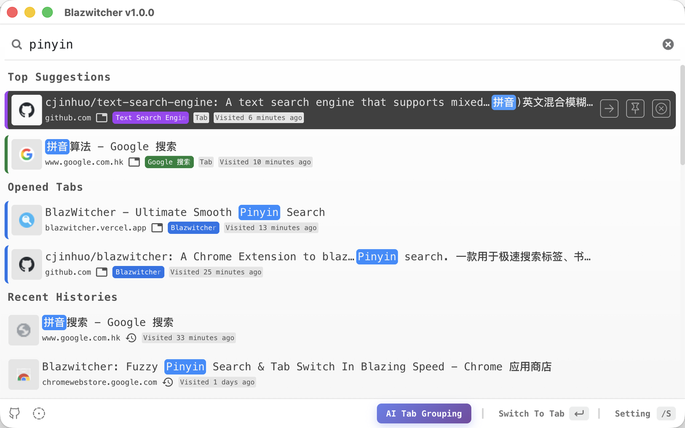

    

A local Chrome Extension for searching tabs, bookmarks, and history

# Overview
[中文 README](./docs/README_zh.md)

[Blazwitcher](https://blazwitcher.vercel.app/) is a local [Chrome Extension](https://chromewebstore.google.com/detail/blazwitcher-search-and-sw/fjgablnemienkegdnbihhemebmmonihg?hl=en-US) for searching tabs, bookmarks, and history, with support for fuzzy **Pinyin** search. It is also the perfect solution for those who work with multiple tabs open and want to switch the correct tab or create a new tab from history or bookmarks quickly without the hassle of manually operation.

## Features
- Fuzzy Pinyin Search: Supports Chinese and English mixed fuzzy search, pinyin is supported by default which's very kind for Chinese(powered by [text-search-engine](https://github.com/cjinhuo/text-search-engine)).
- Intuitive Ordering: The search results are descended by the weight value returned by the [text-search-engine](https://github.com/cjinhuo/text-search-engine) and the last time it was used, allowing you to locate your target faster.
- Tab Search: Search across all Chrome tabs you opened
- History Search: Search the last 200 history item
- Bookmark Search: Search across all your bookmarks
- Switch and create tab rapidly: Just key down 'enter' to switch or open the tab you want rapidly

## Ideal For
Those people who are looking for quick action and speed, like:
- 🧑‍💻 Programers
- 💻 Multitasker
- 🏄🏻 Researchers

# Quick Start
## Install Instruction
**Google Chrome**
1.  visit [Chrome Extension Store](https://chromewebstore.google.com/detail/blazwitcher-search-and-sw/fjgablnemienkegdnbihhemebmmonihg?hl=en-US)
2.  Add it to your browser

## shortcut
The default **shortcut key** to active Blazwitcher Extension is `Command+Shift+K` on Mac, and `Ctrl+Shift+K` on Windows. Of course, you could visit [chrome://extensions/shortcuts](chrome://extensions/shortcuts) to modify it to suit your habits.

# Contributing
Please see the [contributing guidelines](./CONTRIBUTING.md) to learn more.

A big thanks to all of our amazing [contributors](https://github.com/cjinhuo/blazwitcher/graphs/contributors) ❤️

Feel free to join the fun and send a PR!

# 📞 contact
welcome to raise issue, you can contact me on wx or email if you have some good suggestion(notes: Blazwitcher)
* wx: cjinhuo
* email: cjinhuo@qq.com