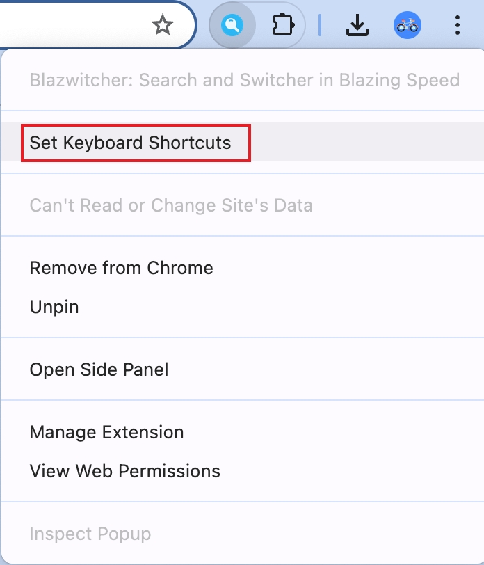

# Overview
A pure Chrome Extension for searching tabs, bookmarks, and history with support for fuzzy **Pinyin** search.

# Quick Start
## install

## fuzzy searching with pinyin

## shortcut
The **shortcut key** to active Blazwitcher Extension is `Command+.(Command+Period)` on Mac, and `Ctrl+.(Ctrl+Period)` on Windows. Of course, you can change 
1. open keyboard shortcuts

2. set keyboard shortcuts

